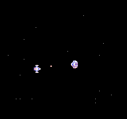

# Family BASIC Tapes
This repository contains both utilities for working with Nintendo Family BASIC tapes, as well as games.

Most of this software was developed for the purpose of [a Leaded Solder blog entry](https://www.leadedsolder.com/), so please visit the blog for more posts about retro computers, old consoles, and other dumb projects with ancient electronics.

## Games
Games have been tested on MAME, as well as real Family BASIC hardware.

To run on MAME, start MAME in Famicom mode with the _Family BASIC v2.1a_ ROM loaded and the keyboard expansion attached. Then add the WAV under File Manager.

Return to Family BASIC, and type `LOAD` and hit return. Open the MAME menu again and use the Tape Control menu to start playing the tape. Return to Family BASIC. After a few seconds, you should see `LOADING` and then `OK` appear. Type `RUN` and hit return to start the game.

If you use the command line for MAME, the invocation looks something like this, but will be dependent on where your files are:

```bash
./mame famicom -cart roms/famicom/Family\ BASIC\ \(Japan\)\ \(v2.1a\).nes -exp fc_keyboard -cass tape.wav
```

### _Space Shooter_
This is a space shooter. You are the heroic left spaceship, fighting against the unending onslaught of right spaceships. Press A to fire upon them, and the directional pad to dodge them.



Each hit of an enemy spaceship gives you ten points. If you get touched by one, you are immediately blown up and given your game over score.

## Utilities
These utilities are of limited use, largely untested, and I strongly recommend using [the _Family BASIC Tape Tool_](https://hvc7.dev/assets/fbtt/index.html) for most of your tape-conversion needs.

 * `wav-to-virtuanes.sh`: Converts WAV tapes to VirtuaNES `*.vtp` files using the `sox` UNIX utility.
 * `virtuanes-to-wav.sh`: Converts VirtuaNES `*.vtp` files back to WAV files.

Thanks to bsittler for the invocations of `sox` at the heart of these tools.